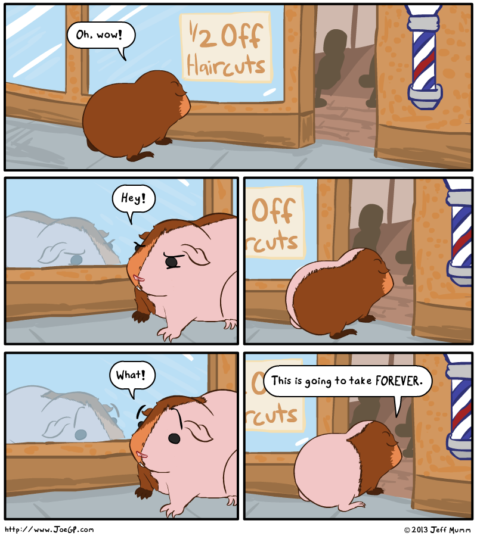

You Can't Handle The Truth
=========

The [http://joegp.com/halfcut/](web cartoon) below, featuring a rodent attempting to get a half-off haircut from a perversely literal-minded barber, is by Jeff Mumm.

The rodent's reasoning is specious. It conflates real numbers and whole numbers, with disastrous results. Let us consider what happens when the rodent is down to one single hair. I see several possibilities, and none of them leads to this haircut actually taking forever.

1) Bust out some sort of "Schrödinger's Hair" rubric, where each repeated visit to the barber incurs a 50% risk of the hair being snipped. This is unsatisfying, as it is contrary to the established practice of deciding which hairs to cut based on partitioning the space remaining on the rodent's body. Also, it wouldn't lead to the haircut taking forever - the expected distribution of expected overall haircut times would look like exponential decay.

2) Snip off half the length of this hair. This is contrary to the established practice of only cutting off entire hairs. And anyways, eventually you'd get down to a single hair protein, at which point you'd have to either

2a) do some Schrödinger biz, either removing the last protein or not at each iteration (see (1) for expected overall haircut time), or

2b) halve the protein, making it no longer hair but just a fucked-up jumble of amino acids, and anyways, if you keep doing this you get down to something indivisible (see (1) for expected overall haircut time).

3) Halve the hair along the axis, i.e. "split" it. All of the objections raised in (2) apply here.

4) Have a rule established about what to do in the case where there is only one hair. We might have different assumptions about whether this rule should be to always chop off the single hair, or to always leave it, but whichever rule is chosen, the result is a well-defined overall haircut time. If the time per haircut were equal, and assuming the rodent originally came in with an even number of hairs, you'd pretty much just multiply the haircut time by the log (base 2) of the number of hairs.

